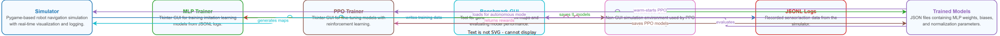
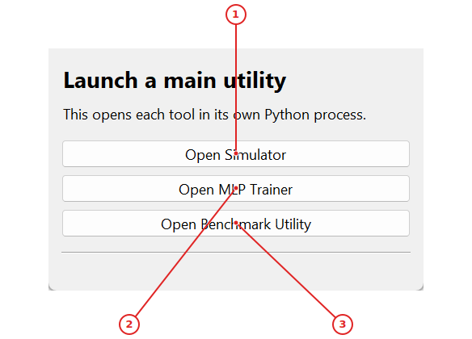
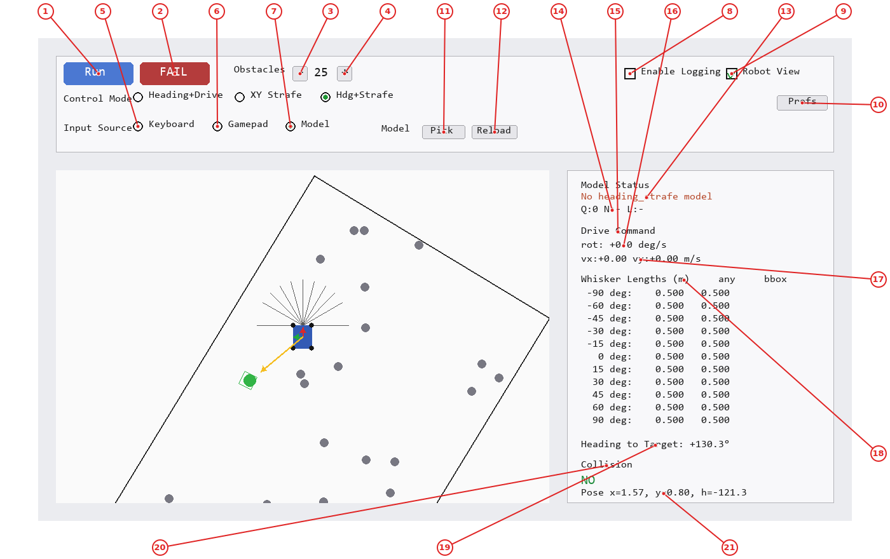
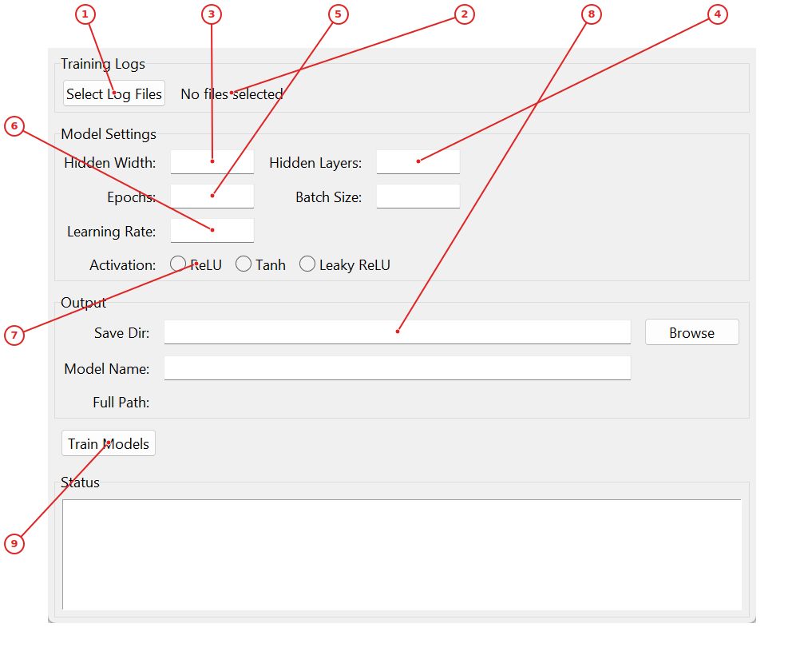
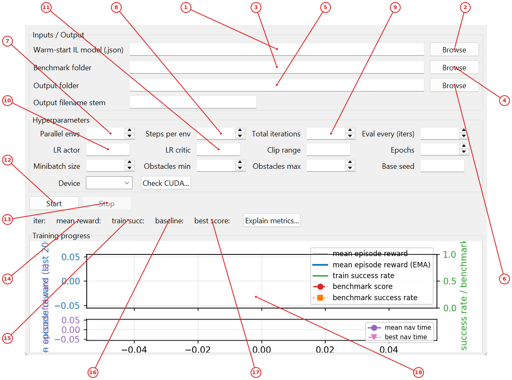
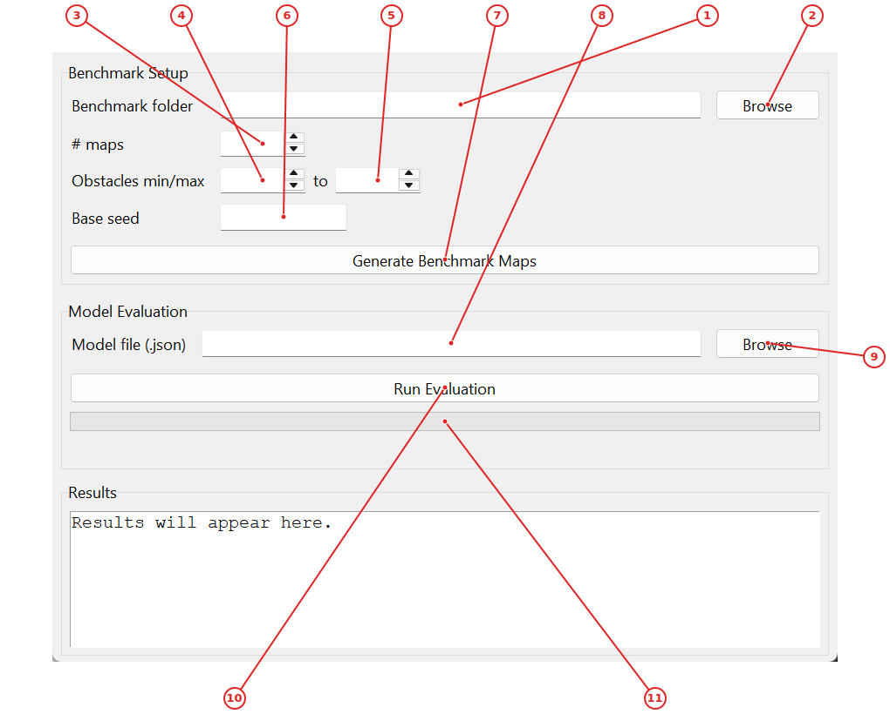

# RoboSim Navigation Trainer

RoboSim Navigation Trainer is an educational robot navigation simulator that lets students explore robot control, sensor processing, and machine‑learning training. It provides a 2‑D pygame visualisation of a robot equipped with whisker‑style range sensors, tools to record interaction logs, and GUIs for training imitation‑learning (MLP) and reinforcement‑learning (PPO) models. The suite also includes a benchmark generator and evaluator to compare model performance on standardized maps. Designed for students and researchers, the project demonstrates the full data‑flow pipeline from simulation to model deployment.

## Getting Started

1. Install the required packages (`pip install -r requirements.txt`).
2. Run `python UTILITY_LAUNCHER.py` to open the Utility Launcher.
3. Click **Open Simulator** to start the navigation simulator, then use the toolbar buttons to control the robot and record logs.
4. Use **Open MLP Trainer** or **Open Benchmark Utility** to train and evaluate models.


## Installation

RoboSim Navigation Trainer requires Python 3.8+ and the following packages:

```bash
pip install -r requirements.txt
```

The `requirements.txt` typically includes:
- `pygame` — for the simulator rendering
- `numpy` — for numerical computations
- `torch` — for PPO neural networks (if using train_ppo.py)
- `matplotlib` — for training plots
- `gym` — for the headless environment interface

If you plan to use the PPO trainer with GPU acceleration, ensure you have a CUDA-compatible GPU and install the appropriate `torch` version with CUDA support.

**Note:** The project uses `pygame-ce` (Community Edition), which is a fork of pygame with continued maintenance.

## Project Structure

The project is organized as follows:

```
RoboSim_Navigation_Trainer/
├── UTILITY_LAUNCHER.py    # Desktop hub for launching all tools
├── simulator.py            # Main pygame-based navigation simulator
├── sim_core.py             # Core robot physics and obstacle generation
├── train_mlp.py            # MLP imitation learning trainer (Tkinter GUI)
├── train_ppo.py            # PPO reinforcement learning trainer (Tkinter GUI)
├── benchmark_gui.py        # Benchmark map generator and model evaluator
├── headless_sim.py         # Non-GUI simulation environment for training
├── nav_env.py              # OpenAI Gym-compatible environment wrapper
├── requirements.txt         # Python dependencies
├── logs/                   # Directory for simulator JSONL log files
├── trained_models/         # Output directory for saved model JSON files
├── benchmark/              # Benchmark map files for standardized evaluation
├── dagger_snapshots/       # Snapshot directory for DAgger iterations
├── images/                 # Simulator image assets (if any)
└── Docs3/                  # Auto-generated documentation (this README lives here)
```

**Key modules for students:**
- `simulator.py` + `sim_core.py` — Understand robot kinematics, whisker sensor math, and environment generation.
- `train_mlp.py` — Study how imitation learning converts logs into neural network weights.
- `train_ppo.py` — Explore policy gradient methods and actor-critic architectures.

## Application architecture

The diagram below shows how data flows between the main modules of RoboSim Navigation Trainer.



## Core Concepts

Before using the tools, understand these key concepts:

**Whisker sensors** — The robot is equipped with 11 virtual whiskers (like a cat's whiskers) spaced at angles from -90° to +90°. Each whisker measures the distance to the nearest obstacle (up to 0.5 m). These distances are the primary input to the navigation models.

**Control modes** — The robot supports three control schemes:
- *Heading+Drive*: Outputs are `drive_speed` (forward/back) and `rotation_rate` (turning speed).
- *XY Strafe*: Outputs are `vx` and `vy` (velocity in x/y directions).
- *Hdg+Strafe*: Combined outputs: `rotation_rate`, `vx`, `vy`.

**Imitation Learning (IL)** — Also called *learning from demonstration*. You drive the robot manually while it records (whisker readings → your actions). A neural network then learns to mimic your driving behavior.

**MLP (Multi-Layer Perceptron)** — A feedforward neural network with one or more hidden layers. The `train_mlp.py` tool trains an MLP using your recorded logs.

**PPO (Proximal Policy Optimization)** — A reinforcement learning algorithm that improves the model by running many parallel simulations, collecting rewards, and updating the policy. PPO can start from (warm-start) an IL model and fine-tune it.

**DAgger** — Dataset Aggregation, an iterative process where the model drives, the human corrects mistakes, and the model retrains on the combined data. The simulator supports DAgger snapshots.

**JSONL logs** — Each line is a JSON object containing a history of whisker lengths, target bearing, and the action taken. These files are the training data for IL.

**Benchmark maps** — Standardized obstacle layouts generated with a fixed random seed. They allow fair comparison between different models.

---

## Launch and navigate the simulator

Start the robot navigation simulator, drive the robot using keyboard or gamepad, and generate training logs for imitation learning.

### How to use

1. Run `python UTILITY_LAUNCHER.py` and click **Open Simulator** (1) to launch the simulator.

2. In the **Simulator Main Window**, click **Run** (1) to start a new episode with random robot pose and obstacles.

3. Select input mode: **Keyboard** (5) for WASD/arrow keys, **Gamepad** (6) for joystick, or **Model** (7) for autonomous mode.

4. Drive the robot toward the green target while avoiding gray obstacles. Whisker readouts (17) show distances to obstacles.

5. Toggle **Enable Logging** (8) to record sensor/action data to JSONL files for later training.

6. When finished, click **Fail** (2) to end the episode and save logs to the `logs/` directory.


### Utility Launcher

Hub window for launching all RoboSim tools in separate processes.



**Labeled controls and displays:**

1. **Open Simulator** — Launches simulator.py in a new Python process.

2. **Open MLP Trainer** — Launches train_mlp.py in a new Python process.

3. **Open Benchmark Utility** — Launches benchmark_gui.py in a new Python process.

Click **Open Simulator** (1) to start the navigation simulator. Click **Open MLP Trainer** (2) to train imitation learning models from logs. Click **Open Benchmark Utility** (3) to generate benchmark maps and evaluate model performance. The status bar at the bottom shows which tool was last launched.


### Simulator Main Window

Pygame-based robot navigation simulation with real-time controls and sensor readouts.



**Labeled controls and displays:**

1. **Run button** — Starts a new navigation episode with random robot pose and obstacles.

2. **Fail button** — Terminates the current episode and writes logs if logging is enabled.

3. **Obstacle minus** — Decreases the number of obstacles in the simulation by one.

4. **Obstacle plus** — Increases the number of obstacles in the simulation by one.

5. **Keyboard radio** — Switches input to keyboard control (WASD/arrow keys).

6. **Gamepad radio** — Switches input to connected gamepad/joystick.

7. **Model radio** — Switches to autonomous mode using a loaded IL/RL model.

8. **Enable Logging** — Toggles recording of sensor/action data to JSONL log files.

9. **Robot View** — When checked, the simulation view rotates to follow the robot heading.

10. **Preferences** — Opens the preferences dialog for advanced simulation settings.

11. **Model Pick** — Opens file dialog to select a trained model JSON file.

12. **Model Reload** — Reloads the currently selected model from disk.

13. **Model Status** — Shows which control-mode model is loaded or 'No model' if none.

14. **Episode counters** — Displays current episode/step counts (Q=episodes, N=steps, L=logs).

15. **Drive Command** — Section header for the current control-mode outputs.

16. **Rotation rate** — Live readout of robot's current turning speed in deg/s.

17. **Velocity readout** — Live readout of robot's linear velocity components in m/s.

18. **Whisker readouts** — Section header for the 11 whisker distance measurements to obstacles.

19. **Heading to Target** — Current bearing from robot to target in degrees (positive = clockwise).

20. **Collision status** — Displays 'YES' if robot is currently colliding with an obstacle or wall.

21. **Robot Pose** — Live readout of robot position (x,y) in meters and heading in degrees.

Use **Run** (1) to start a new episode and **Fail** (2) to terminate the current episode. Adjust obstacle count with the +/- buttons (3-4). Select input source: **Keyboard** (5), **Gamepad** (6), or **Model** (7). Toggle **Enable Logging** (8) to record training data and **Robot View** (9) to align display with robot heading. Open **Preferences** (10) to adjust advanced settings. When in Model mode, use **Pick** (11) to select a trained model and **Reload** (12) to refresh. The right panel shows live readouts: model status (13), episode/step counters (14), drive commands (15-16), whisker lengths (17), heading to target (18), collision status (19), and robot pose (20).

---

## Train an imitation learning model (MLP)

Use the MLP Trainer to teach a neural network to mimic your navigation behavior from recorded logs.

### How to use

1. First, generate training logs by running the simulator with logging enabled (see 'Launch and navigate the simulator' workflow).

2. Run `python UTILITY_LAUNCHER.py` and click **Open MLP Trainer** (2) to open the **MLP Trainer**.

3. In the **MLP Trainer**, click **Select Log Files** (1) and choose the JSONL files from the `logs/` directory.

4. Configure network architecture: set **Hidden Width** (3), **Hidden Layers** (4), **Epochs** (5), **Batch Size**, and **Learning Rate** (6).

5. Choose an activation function: **ReLU**, **Tanh**, or **Leaky ReLU** (7).

6. Set the **Save Dir** (8) and optional **Model Name**, then click **Train Models** (9) to start training.

7. The status area shows training progress. When complete, model JSON files are saved to the output directory.


### MLP Trainer

GUI for training multi-layer perceptron models from navigation logs using imitation learning.



**Labeled controls and displays:**

1. **Select Log Files** — Opens file dialog to pick JSONL navigation log files.

2. **File count** — Shows how many log files are currently selected.

3. **Hidden Width** — Number of neurons in each hidden layer of the MLP.

4. **Hidden Layers** — Number of hidden layers in the neural network.

5. **Epochs** — Number of complete passes through the training dataset.

6. **Learning Rate** — Step size for gradient descent during training.

7. **ReLU radio** — Selects ReLU activation for hidden layers.

8. **Save Dir** — Folder where trained model JSON and metrics are saved.

9. **Train Models** — Starts imitation learning training for all modes found in logs.

Click **Select Log Files** (1) to choose one or more JSONL log files. The file count appears in the label (2). Configure the network architecture: **Hidden Width** (3) sets neurons per layer, **Hidden Layers** (4) sets depth. Set **Epochs** (5) and **Learning Rate** (6), then choose an activation function via the radio buttons (7). Specify the **Save Dir** (8) and optional **Model Name**, then click **Train Models** (9) to start training. The status area shows progress and saved file paths.

---

## Fine-tune with PPO reinforcement learning

Improve a trained imitation learning model using Proximal Policy Optimization in headless simulation.

### How to use

1. Run `python train_ppo.py` to open the **PPO Trainer**.

2. Enter the path to a trained IL model in **Warm-start IL model** (1) or click **Browse** (2) to select it.

3. Set **Benchmark folder** (3) and **Output folder** (4-5) for evaluation and model saving.

4. Configure hyperparameters: **Parallel envs** (7), **Steps per env** (8), **Total iterations** (9), learning rates (10-11), and others.

5. Click **Start** (12) to begin PPO training. The live plot (18) shows reward, success rates, and benchmark scores.

6. Monitor the readouts: **mean reward** (13), **train succ** (14), **baseline** (15), and **best score** (16).

7. Click **Stop** (13) to halt training early. The best model is saved automatically.


### PPO Trainer

GUI for fine-tuning navigation models using Proximal Policy Optimization with live plots.



**Labeled controls and displays:**

1. **Warm-start model** — Path to a pre-trained IL model JSON to initialize PPO.

2. **Browse warm-start** — Opens file dialog to pick IL model JSON file.

3. **Benchmark folder** — Directory containing benchmark map files for evaluation.

4. **Browse benchmark** — Opens directory chooser for benchmark maps.

5. **Output folder** — Directory where PPO model checkpoints will be saved.

6. **Browse output** — Opens directory chooser for output models.

7. **Parallel envs** — Number of parallel simulation environments for training.

8. **Steps per env** — Simulation steps per environment per PPO iteration.

9. **Total iterations** — Number of PPO training iterations to run.

10. **LR actor** — Learning rate for the PPO actor network.

11. **LR critic** — Learning rate for the PPO critic network.

12. **Start button** — Starts the PPO training loop in a background thread.

13. **Stop button** — Stops the currently running training loop.

14. **Mean reward** — Live readout of mean episode reward (last 200 episodes).

15. **Train success** — Live readout of training success rate (0-1).

16. **Baseline score** — Benchmark score of the warm-start IL model.

17. **Best score** — Best PPO benchmark score achieved so far.

18. **Training plot** — Live matplotlib plot of reward, success rates, and benchmark scores.

Enter the **Warm-start IL model** path (1) or browse (2) to load a pre-trained imitation learning model. Set **Benchmark folder** (3) and **Output folder** (4-5). Configure hyperparameters: **Parallel envs** (7), **Steps per env** (8), **Total iterations** (9), learning rates (10-11), **Clip range** (12), **Epochs** (13), **Minibatch size** (14), obstacle counts (15-16), and **Base seed** (17). Choose **Device** (18) and click **Start** (12) to begin PPO training. The live plot (18) shows reward, success rates, and benchmark scores.

---

## Benchmark and evaluate models

Generate standardized test maps and measure model performance with success rates and navigation times.

### How to use

1. Run `python UTILITY_LAUNCHER.py` and click **Open Benchmark Utility** (3) to open the **Benchmark Evaluator**.

2. In the **Benchmark Setup** section, set **Benchmark folder** (1) and number of **# maps** (3) to generate.

3. Configure obstacle range with **Obstacles min/max** (4-5) and **Base seed** (6), then click **Generate Benchmark Maps** (7).

4. For evaluation, enter the **Model file** path (8) or click **Browse** (9) to select a trained model JSON.

5. Click **Run Evaluation** (10). Progress appears in the bar (11) and detailed results show in the text area.

6. Results include success rate, mean navigation time, and benchmark score for the model.


### Benchmark Evaluator

GUI for generating benchmark maps and evaluating model performance on standardized scenarios.



**Labeled controls and displays:**

1. **Benchmark folder** — Directory where benchmark map files are stored.

2. **Browse benchmark** — Opens directory chooser for benchmark maps.

3. **# maps** — Number of benchmark maps to generate.

4. **Obstacles min** — Minimum number of obstacles per benchmark map.

5. **Obstacles max** — Maximum number of obstacles per benchmark map.

6. **Base seed** — Random seed for reproducible map generation.

7. **Generate Maps** — Creates benchmark maps with specified parameters.

8. **Model file** — Path to trained model JSON file for evaluation.

9. **Browse model** — Opens file dialog to select model JSON.

10. **Run Evaluation** — Evaluates model on all benchmark maps and reports metrics.

11. **Progress bar** — Shows evaluation progress across benchmark maps.

Enter the **Benchmark folder** (1) or browse (2) to set where maps are stored. Set **# maps** (3) to generate, plus obstacle min/max (4-5) and **Base seed** (6). Click **Generate Benchmark Maps** (7) to create standardized test scenarios. For evaluation, enter the **Model file** path (8) or browse (9), then click **Run Evaluation** (10). Progress appears in the bar (11) and detailed results show in the text area.

---


---

## CLI and Script Reference

Although the primary tools are GUIs, you can also launch each module directly from the command line.

### `UTILITY_LAUNCHER.py`
Desktop hub that opens other tools in separate processes.
```bash
python UTILITY_LAUNCHER.py
```

### `simulator.py`
Main navigation simulator with pygame rendering.
```bash
python simulator.py
```
**Interactive controls:**
- `W`/`S` or arrow keys: drive forward/backward
- `A`/`D` or arrow keys: turn left/right
- `Space`: toggle logging on/off
- `R`: start new episode (Run)
- `F`: fail current episode
- `1`: switch to Keyboard input
- `2`: switch to Gamepad input
- `3`: switch to Model (autonomous) mode
- `4`: Heading+Drive control mode
- `5`: XY Strafe control mode
- `6`: Hdg+Strafe control mode

### `train_mlp.py`
Imitation learning trainer for MLPs.
```bash
python train_mlp.py
```

### `train_ppo.py`
PPO reinforcement learning fine-tuning.
```bash
python train_ppo.py
```

### `benchmark_gui.py`
Benchmark map generator and model evaluator.
```bash
python benchmark_gui.py
```

### `headless_sim.py`
Non-GUI simulation environment (used by PPO trainer).
```bash
# Typically called internally by train_ppo.py
python headless_sim.py
```


---

## Configuration

### Simulator preferences (`simulator_prefs.json`)
The simulator saves user preferences to `simulator_prefs.json` in the project root. You can edit this file directly or use the **Preferences** dialog (button 10 in the simulator).

| Setting | Description | Default |
|---------|-------------|---------|
| `history_len` | Number of timesteps in the input window (1–10) | 1 |
| `active_log_rate_hz` | Logging frequency when obstacles are near (1–30 Hz) | 10.0 |
| `min_turn_rate_dps` | Minimum turn rate in degrees/sec (0–39) | 0.0 |
| `inner_deadband_dps` | Deadband around zero turn rate (0–min_turn_rate) | 0.0 |
| `hysteresis_band_dps` | Hysteresis band to prevent jitter (0–min_turn_rate) | 0.0 |
| `obstacle_count` | Default number of obstacles per episode (1–50) | random 3–10 |
| `vis_mode` | Visualization mode: `all`, `action_radius`, `detected`, `sparse_sensing` | `all` |
| `input_mode` | Default input: `keyboard`, `gamepad`, `model` | `keyboard` |
| `logging_enabled` | Whether logging is on by default | `false` |
| `robot_aligned_view` | Whether the view follows the robot heading | `true` |
| `control_mode` | Default control: `heading_drive`, `xy_strafe`, `heading_strafe` | `heading_drive` |
| `place_against_wall` | Place target against a wall | `false` |

### Model file format
Trained models are saved as JSON files with the following structure:
```json
{
  "schema_version": 2,
  "mode": "heading_drive",
  "weights": [ [...], ...],      // List of weight matrices
  "biases": [ [...], ...],        // List of bias vectors
  "x_scale": { "mean": [...], "std": [...] },  // Input normalization
  "y_scale": { "mean": [...], "std": [...] },  // Output normalization
  "history_len": 1
}
```


---

## Troubleshooting

### Simulator fails to open
- Ensure `pygame` is installed (`pip install pygame`).
- Check that your display environment supports GUI applications (some headless servers require `xvfb`).

### No gamepad detected
- Verify the gamepad is connected before launching the simulator.
- On Linux, you may need to install `joystick` package and run `jstest` to verify.

### MLP training crashes with “shape mismatch”
- Make sure you are using logs generated with the same `history_len` as expected by the model.
- Re‑train with matching settings or delete old logs.

### PPO trainer shows “CUDA out of memory”
- Reduce **Parallel envs** (7) or **Minibatch size** (14).
- Switch **Device** (18) to `cpu` if you don’t have a compatible GPU.

### Benchmark evaluation is slow
- Reduce the number of **# maps** (3) or obstacle counts.
- Evaluation runs sequentially; consider using fewer maps for quick checks.

### Model fails to load (“Mode mismatch”)
- The model JSON was trained for a different control mode.
- Re‑train a model for the desired mode or switch the simulator to the correct mode.


*Generated by [auto_labeler](https://github.com/auto-labeler).*