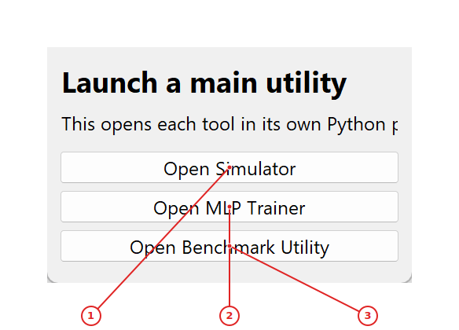
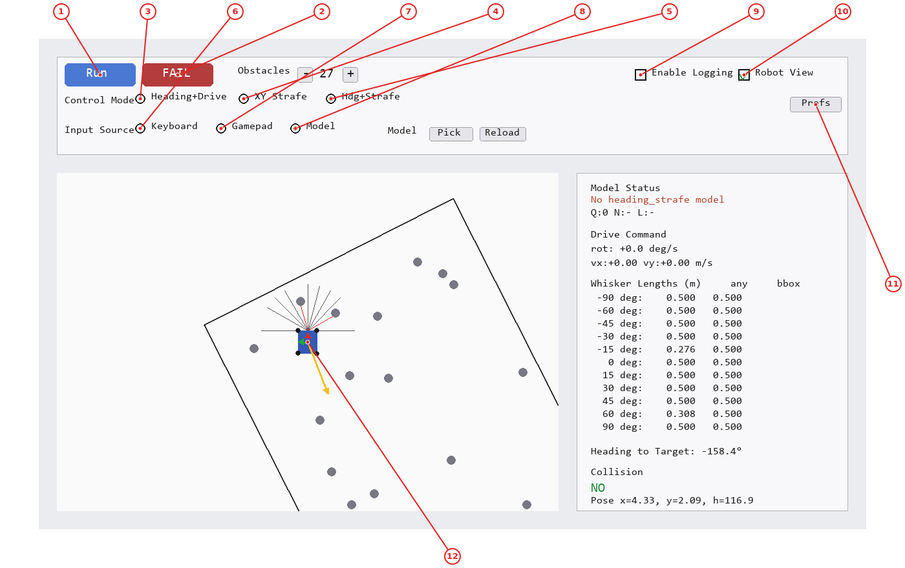
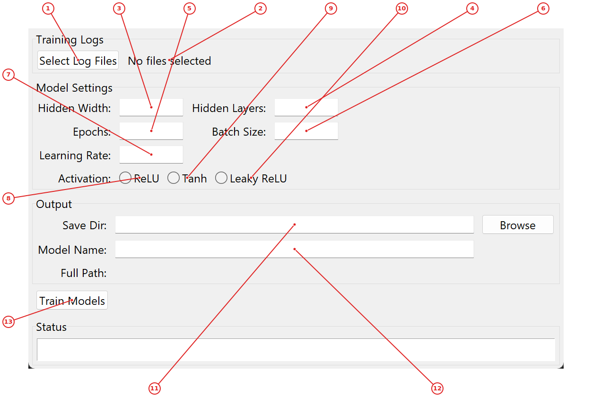
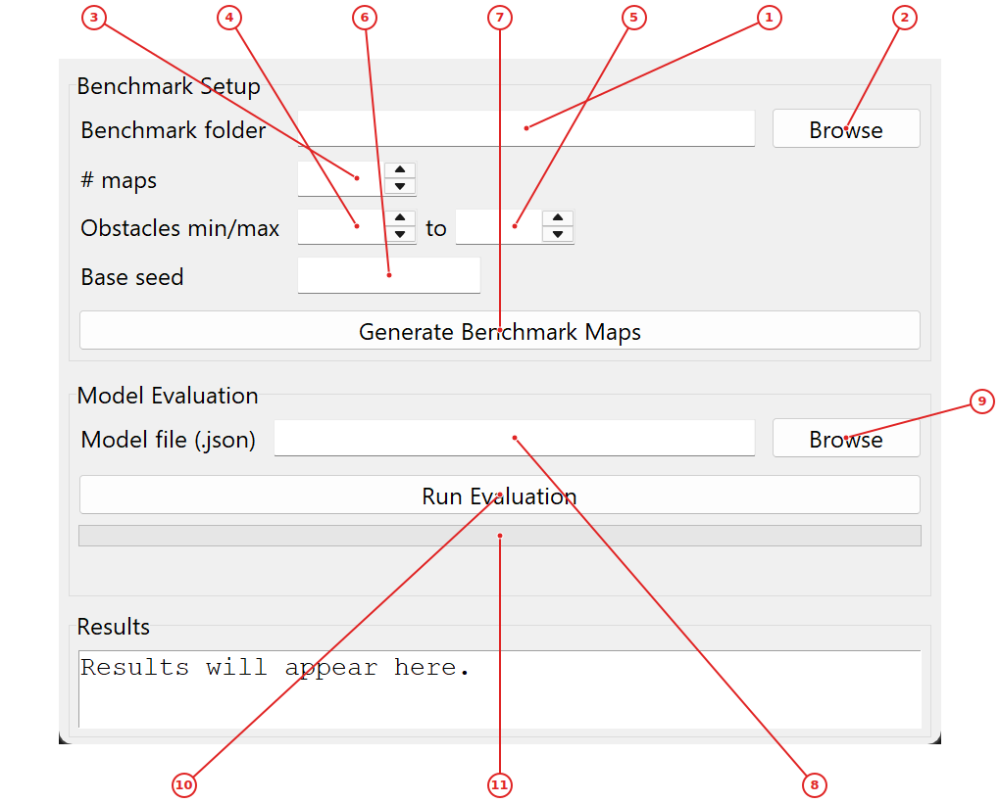

# RoboSim Navigation Trainer

RoboSim Navigation Trainer is a comprehensive robotics simulation and training system designed to teach robots navigation using imitation learning with whisker sensors. The system enables researchers, students, and developers to collect robot navigation data, train machine learning models, evaluate performance, and deploy to real robots.

The project consists of four main tools: an interactive simulator for data collection, an MLP trainer for imitation learning, a benchmark utility for evaluation, and a utility launcher that provides centralized access. The simulator features a robot with 11 whisker sensors that detect obstacles, and supports three control modes for different navigation strategies.

At its core, RoboSim uses a physics-based simulation where a robot must navigate to targets while avoiding obstacles. The system collects sensor data (whisker distances and heading to target) along with expert control actions, which are then used to train Multi-Layer Perceptron (MLP) models. These models can be evaluated on benchmark scenarios and deployed to real robots via ROS 2.

The project is particularly valuable for robotics education and research, providing a complete pipeline from simulation to real-world deployment with consistent data formats and evaluation metrics.

## Getting Started

To get started with RoboSim Navigation Trainer:

1. **Install dependencies**: Run `pip install -r requirements.txt` to install pygame, numpy, and other required packages.

2. **Launch the Utility Launcher**: Run `python UTILITY_LAUNCHER.py` to open the central launcher that gives you access to all tools.

3. **Start with the Simulator**: Click "Open Simulator" in the launcher to begin collecting navigation data. Use keyboard controls (WASD or arrow keys) to navigate the robot to targets while avoiding obstacles.

4. **Collect training data**: Enable logging in the simulator and complete several successful navigation episodes to build a dataset.

5. **Train a model**: Use the MLP Trainer to load your collected logs and train an imitation learning model.

6. **Evaluate performance**: Use the Benchmark Utility to test your trained model on standardized scenarios.

For first-time users, we recommend starting with the simulator to understand the robot's behavior and sensor inputs before moving to training and evaluation.

---

## Interactive robot control and data collection

Learn to control the simulated robot and collect training data for imitation learning. This workflow covers basic navigation, understanding sensor inputs, and logging successful episodes.

### How to use

1. Launch the Utility Launcher and click **Open Simulator** (1) to start the main simulator

2. In the simulator, select your control mode using the radio buttons (3-5): **Heading** for forward/rotate, **XY Strafe** for lateral movement, or **Heading+Strafe** for combined control

3. Choose input method with radio buttons (6-8): **Keyboard** for manual control, **Gamepad** if connected, or **Model** to use a trained policy

4. Click **Run** (1) to start a new navigation episode - the robot appears in a room with obstacles and a target

5. Navigate using keyboard controls: WASD or arrow keys to move, Q/E to rotate

6. Avoid obstacles (gray circles) and reach the green target circle to complete the episode

7. Enable logging by checking **Logging** checkbox (9) to record successful episodes for training

8. Toggle **Robot View** checkbox (10) to switch between world-aligned and robot-aligned perspectives

9. If stuck, click **Fail** (2) to end the current episode and start fresh

10. Collect multiple successful episodes with different obstacle configurations to build a diverse dataset

### Utility Launcher

Central launcher that provides one-click access to all main tools in the RoboSim Navigation Trainer project.

**Labeled controls and displays:**

1. **Open Simulator button** — Launches the main robot navigation simulator for data collection

2. **Open MLP Trainer button** — Opens the MLP training interface for imitation learning

3. **Open Benchmark Utility button** — Starts the benchmark evaluation tool for model testing

The Utility Launcher is your starting point for the entire RoboSim system. Click **Open Simulator** (1) to begin controlling the robot and collecting data. Use **Open MLP Trainer** (2) to train imitation learning models from your collected logs. Select **Open Benchmark Utility** (3) to evaluate trained models on standardized scenarios. The status display shows launch confirmation messages. All tools open in separate processes, allowing you to run multiple applications simultaneously.

### Main Simulator

Primary robot navigation simulator with visual feedback, data collection, and model inference capabilities.

**Labeled controls and displays:**

1. **Run button** — Starts a new navigation episode with random obstacles and target

2. **Fail button** — Ends current episode and triggers DAgger human takeover in model mode

3. **Heading control radio** — Sets control mode to heading_drive (forward speed + rotation rate)

4. **XY Strafe control radio** — Sets control mode to xy_strafe (lateral movement in body frame)

5. **Heading+Strafe control radio** — Sets control mode to heading_strafe (combined rotation + lateral)

6. **Keyboard input radio** — Sets input mode to keyboard for manual control

7. **Gamepad input radio** — Sets input mode to gamepad if controller is connected

8. **Model input radio** — Sets input mode to model for autonomous policy execution

9. **Logging checkbox** — Toggles data logging for successful navigation episodes

10. **Robot view checkbox** — Toggles between world-aligned and robot-aligned camera views

11. **Preferences button** — Opens preferences panel for simulation parameter adjustment

12. **Simulation canvas** — Displays robot, obstacles, target, whisker sensors, and navigation visualization

The Main Simulator is where you control the robot and collect training data. Click **Run** (1) to start a new navigation episode in a room with randomly placed obstacles. Use **Fail** (2) to end the current episode. Select your control strategy with the radio buttons (3-5): **Heading** for forward/rotate control, **XY Strafe** for lateral movement, or **Heading+Strafe** for combined control. Choose input method with radio buttons (6-8): **Keyboard** for manual control, **Gamepad** if connected, or **Model** to use a trained policy. Enable **Logging** (9) to record successful episodes for training. Toggle **Robot View** (10) to switch between world-aligned and robot-aligned perspectives. Click **Preferences** (11) to adjust simulation parameters like history length and logging rate. The simulation canvas (12) shows the robot, obstacles, target, and sensor readings.

---

## Training imitation learning models

Train Multi-Layer Perceptron (MLP) models from collected navigation logs using imitation learning. This workflow covers data preparation, model configuration, and training execution.

### How to use

1. From the Utility Launcher, click **Open MLP Trainer** (2) to launch the training interface

2. Click **Select Log Files** (1) to choose the JSONL log files collected from the simulator

3. Configure model architecture: set **Hidden Width** (3) and **Hidden Layers** (4) for network size

4. Set training parameters: **Epochs** (5) for training duration, **Batch Size** (6) for optimization, and **Learning Rate** (7) for gradient descent

5. Choose activation function with radio buttons (8-10): **ReLU** for standard networks, **Tanh** for bounded outputs, or **Leaky ReLU** to avoid dead neurons

6. Specify output directory in **Save Dir** field (11) where trained models will be saved

7. Enter a descriptive **Model Name** (12) to identify this training run

8. Review the full path preview to confirm save location

9. Click **Train Models** (13) to begin training - progress will show in the status area

10. Monitor training progress through the console output; models are saved automatically upon completion

### MLP Trainer

GUI for training Multi-Layer Perceptron (MLP) models from collected navigation logs using imitation learning.

**Labeled controls and displays:**

1. **Select Log Files button** — Opens file dialog to choose JSONL log files for training

2. **Files status label** — Shows count of selected log files or 'No files selected'

3. **Hidden Width entry** — Sets number of neurons in each hidden layer

4. **Hidden Layers entry** — Sets number of hidden layers in the network

5. **Epochs entry** — Sets number of training epochs

6. **Batch Size entry** — Sets batch size for gradient descent

7. **Learning Rate entry** — Sets learning rate for optimization

8. **ReLU activation radio** — Selects ReLU activation function for hidden layers

9. **Tanh activation radio** — Selects Tanh activation function for hidden layers

10. **Leaky ReLU activation radio** — Selects Leaky ReLU activation function for hidden layers

11. **Save Directory entry** — Sets output directory for trained models and metrics

12. **Model Name entry** — Sets base name for saved model files

13. **Train Models button** — Starts training process with configured parameters

The MLP Trainer processes collected navigation logs to train imitation learning models. Start by clicking **Select Log Files** (1) to choose JSONL files from your simulator sessions. The status label (2) shows how many files are selected. Configure the model architecture with **Hidden Width** (3) and **Hidden Layers** (4) entries. Set training parameters: **Epochs** (5) for training duration, **Batch Size** (6) for optimization steps, and **Learning Rate** (7) for gradient descent. Choose an activation function with radio buttons (8-10): **ReLU** for standard networks, **Tanh** for bounded outputs, or **Leaky ReLU** to avoid dead neurons. Specify where to save models in the **Save Dir** field (11) and enter a **Model Name** (12) to identify this training run. Finally, click **Train Models** (13) to begin training. Monitor progress through console output and status messages.

---

## Evaluating trained models

Generate benchmark scenarios and evaluate trained models in standardized conditions for apples-to-apples performance comparison.

### How to use

1. Launch the Benchmark Utility from the Utility Launcher by clicking **Open Benchmark Utility** (3)

2. Set up benchmark generation: enter a **Benchmark folder** path (1) or click **Browse** (2) to select where maps will be saved

3. Configure map generation: set **# maps** (3) for how many scenarios to create, **Obstacles min/max** (4-5) for difficulty range, and **Base seed** (6) for reproducibility

4. Click **Generate Benchmark Maps** (7) to create standardized evaluation scenarios

5. Load a trained model: enter the **Model file** path (8) or click **Browse** (9) to select a .json model from training

6. Click **Run Evaluation** (10) to test the model on all generated benchmark maps

7. Monitor progress through the **Progress bar** (11) and status messages

8. Review evaluation results in the output area - metrics include success rate, average time to target, and collision statistics

9. Compare different models by repeating evaluation with alternative model files

10. Use consistent benchmark settings for fair comparison between different training runs or model architectures

### Benchmark Utility

Tool for generating benchmark maps and evaluating trained models on standardized scenarios.

**Labeled controls and displays:**

1. **Benchmark folder entry** — Sets directory where benchmark maps will be saved

2. **Browse folder button** — Opens directory dialog to select benchmark folder

3. **Maps count spinbox** — Sets number of benchmark scenarios to generate

4. **Min obstacles spinbox** — Sets minimum number of obstacles per scenario

5. **Max obstacles spinbox** — Sets maximum number of obstacles per scenario

6. **Base seed entry** — Sets random seed for reproducible map generation

7. **Generate Maps button** — Creates benchmark scenarios with configured parameters

8. **Model file entry** — Sets path to trained model JSON file for evaluation

9. **Browse model button** — Opens file dialog to select trained model

10. **Run Evaluation button** — Tests selected model on all benchmark scenarios

11. **Progress bar** — Shows evaluation progress across benchmark scenarios

The Benchmark Utility creates reproducible evaluation scenarios and tests trained models for apples-to-apples comparison. First, set up benchmark generation by entering a **Benchmark folder** path (1) or clicking **Browse** (2) to select where maps will be saved. Configure map generation with **# maps** (3) for scenario count, **Obstacles min/max** (4-5) for difficulty range, and **Base seed** (6) for reproducibility. Click **Generate Benchmark Maps** (7) to create standardized evaluation scenarios. To test a model, enter the **Model file** path (8) or click **Browse** (9) to select a .json model from training. Click **Run Evaluation** (10) to test the model on all generated benchmark maps. Monitor progress through the **Progress bar** (11) and status messages. Review evaluation results in the output area below the controls.

---

*Generated by [auto_labeler](https://github.com/auto-labeler).*